# Software Testing

## Лабораторная Работа 2

- Выполнил: Кузьмин Артемий Андреевич
- Проверил: Наумова Надежда Александровна
- Выриант: 4356719

### Вариант 4356719

```text
x <= 0 : (((((((((((cos(x) / csc(x)) / csc(x)) / (cot(x) / cot(x))) + ((sec(x) - csc(x)) * cos(x))) + cos(x)) / (tan(x) / cos(x))) * sec(x)) ^ 2) ^ 3) ^ 2) + (((sin(x) * (csc(x) ^ 2)) * cot(x)) + cot(x)))

x > 0 : (((((log_10(x) + log_2(x)) + log_3(x)) - ((log_5(x) + log_10(x)) / (log_10(x) + log_2(x)))) - (((log_2(x) / log_5(x)) / log_5(x)) + ln(x))) + ln(x))
```

### Задание

#### Правила выполнения работы

1. Все составляющие систему функции (как тригонометрические, так и логарифмические) должны быть выражены через базовые (тригонометрическая зависит от варианта; логарифмическая - натуральный логарифм).
2. Структура приложения, тестируемого в рамках лабораторной работы, должна выглядеть следующим образом (пример приведён для базовой тригонометрической функции sin(x)):
3. Обе "базовые" функции (в примере выше - sin(x) и ln(x)) должны быть реализованы при помощи разложения в ряд с задаваемой погрешностью. Использовать тригонометрические / логарифмические преобразования для упрощения функций ЗАПРЕЩЕНО.
4. Для КАЖДОГО модуля должны быть реализованы табличные заглушки. При этом, необходимо найти область допустимых значений функций, и, при необходимости, определить взаимозависимые точки в модулях.
5. Разработанное приложение должно позволять выводить значения, выдаваемое любым модулем системы, в сsv файл вида «X, Результаты модуля (X)», позволяющее произвольно менять шаг наращивания Х. Разделитель в файле csv можно использовать произвольный.

#### Порядок выполнения работы

1. Разработать приложение, руководствуясь приведёнными выше правилами.
2. С помощью JUNIT5 разработать тестовое покрытие системы функций, проведя анализ эквивалентности и учитывая особенности системы функций. Для анализа особенностей системы функций и составляющих ее частей можно использовать сайт [wolframalpha](https://www.wolframalpha.com/).
3. Собрать приложение, состоящее из заглушек. Провести интеграцию приложения по 1 модулю, с обоснованием стратегии интеграции, проведением интеграционных тестов и контролем тестового покрытия системы функций.

### Ход работы

В качестве тестового покрытия выбирались характерные для каждой функции точки (максимум/минимкум, пересечение с осями, разрывы, граничные случаи)

В качестве стратегии интеграции была выбрана стратегия сверху-вниз. В данном случае, если в коде есть ошибка, то эта стратегия поможет изолировать ее до уровня слоя, что помогает легче индетифицироваить проблему

#### Графики csv выгрузок

$sin(\alpha), \alpha \in [-\pi;\pi]$

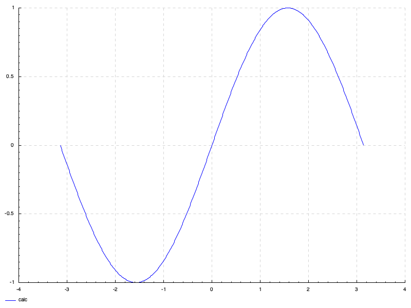

$cos(\alpha), \alpha \in [-\pi;\pi]$

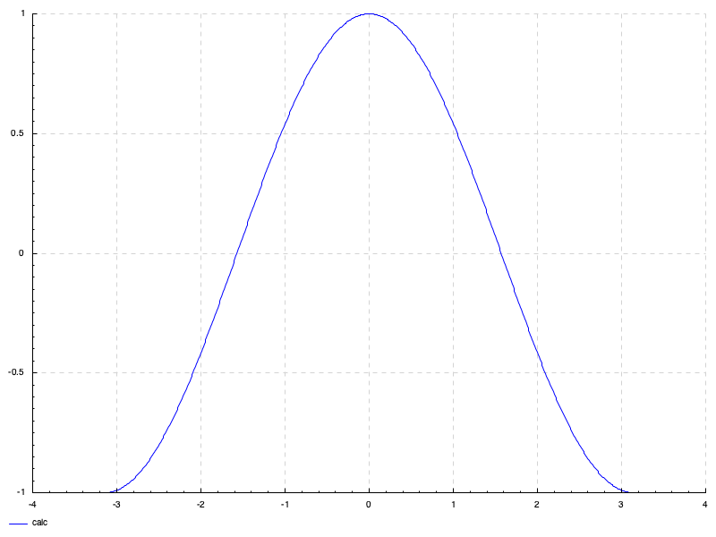

$tg(\alpha), \alpha \in [-\frac{\pi}{3};\frac{\pi}{3}]$

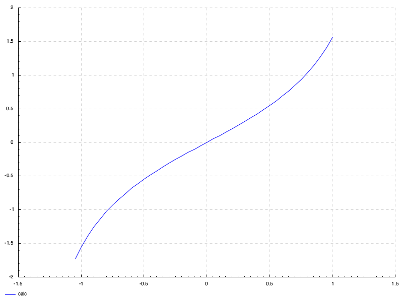

$ctg(\alpha), \alpha \in [\frac{\pi}{6};\frac{5\pi}{6}]$

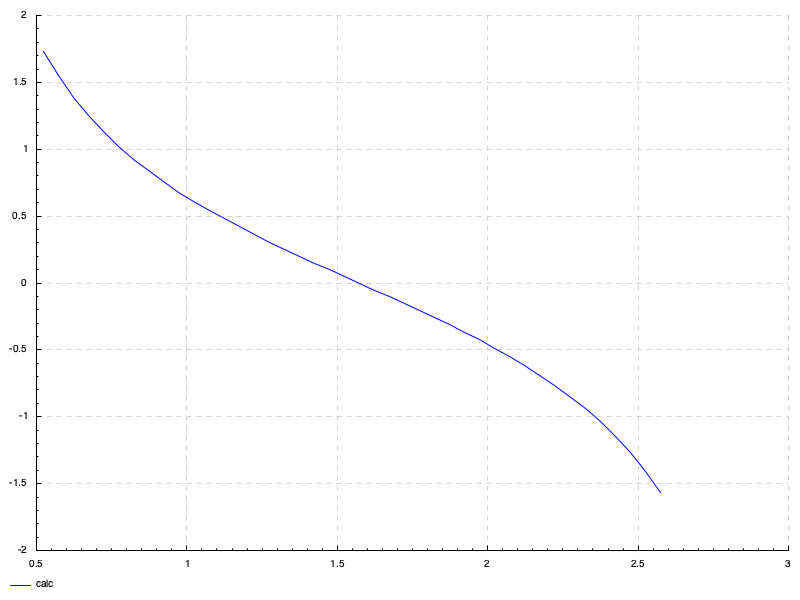

$sec(\alpha), \alpha \in [-\frac{\pi}{3};\frac{4\pi}{3}]$

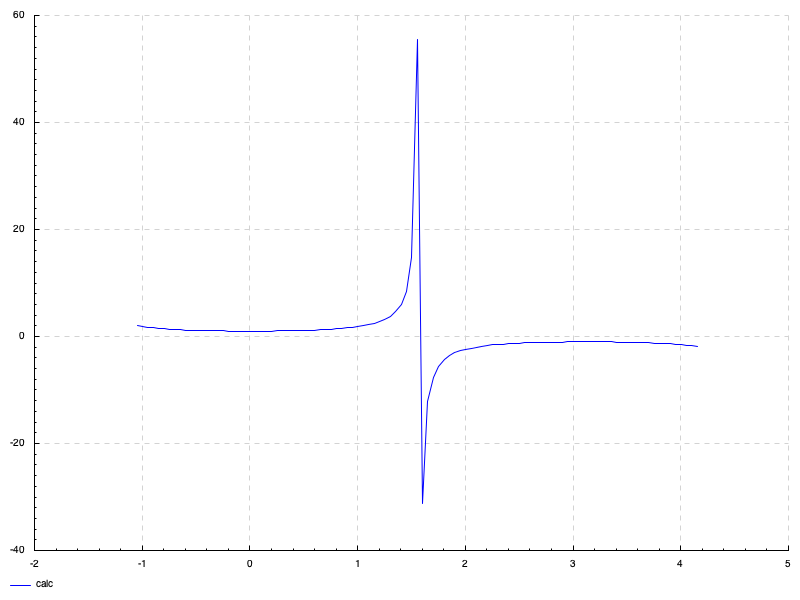

$csc(\alpha), \alpha \in [-\frac{5\pi}{6};\frac{5\pi}{6}]$

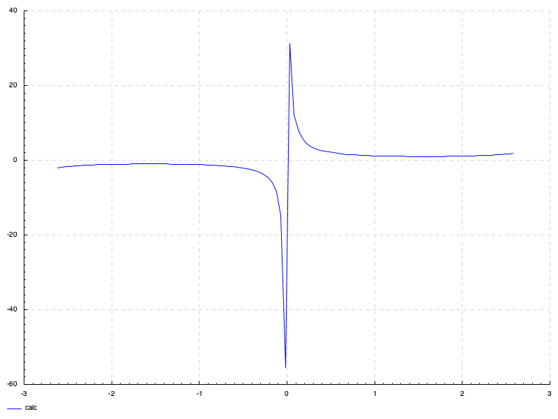

$ln(x), x \in [0;5]$

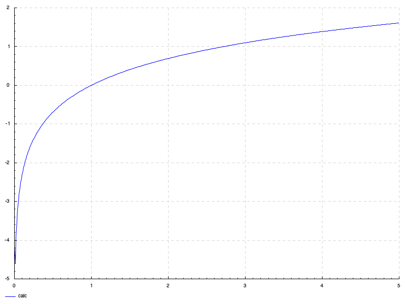

$log_{2}(x), x \in [0;10]$

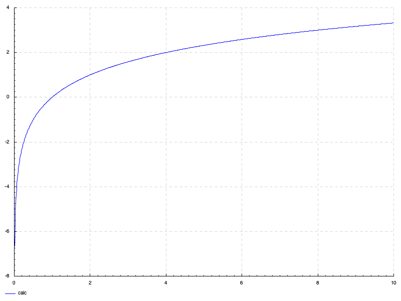

$log_3(x), x \in [0;10]$

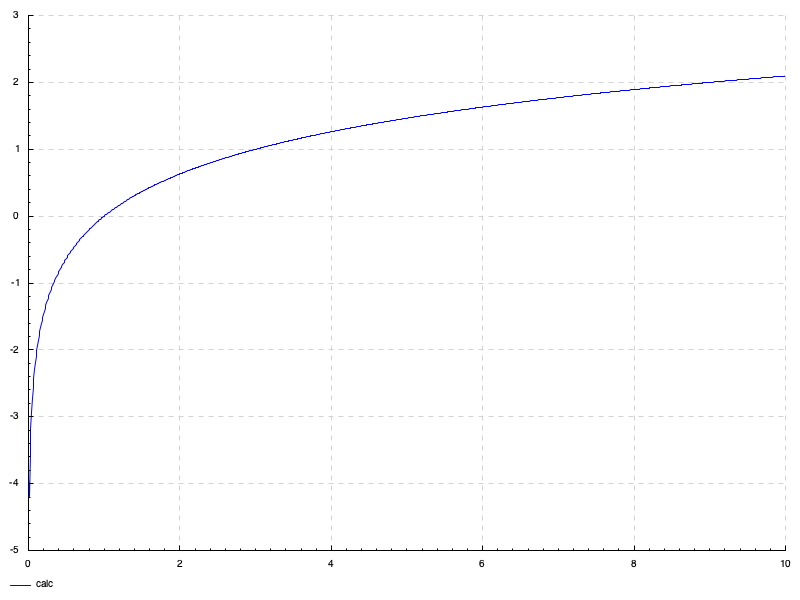

$log_5(x), x \in [0;10]$

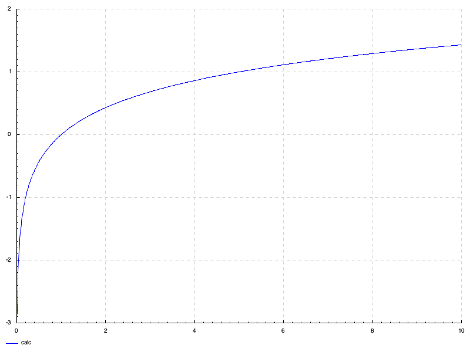

$log_{10}(x), x \in [0;10]$

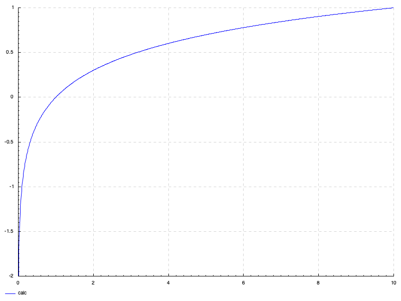

[f](#вариант-4356719)$(x), x \in [-5.9;-3.86]$

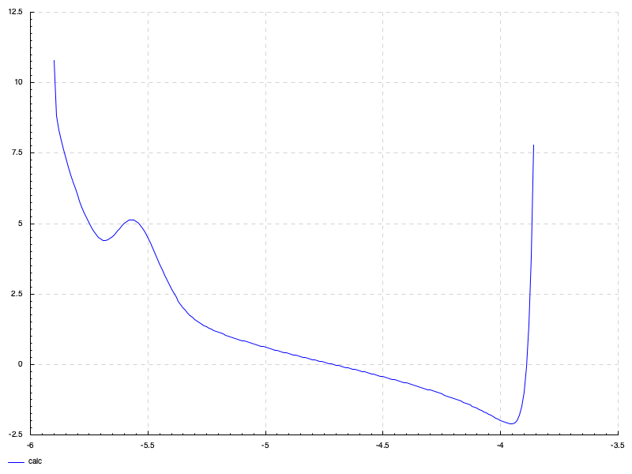

[f](#вариант-4356719)$(x), x \in [-2.38;-1.1]$

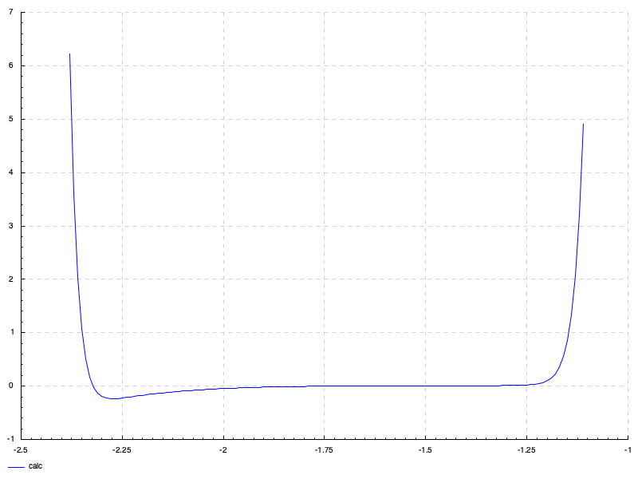

[f](#вариант-4356719)$(x), x \in [0.05;12]$

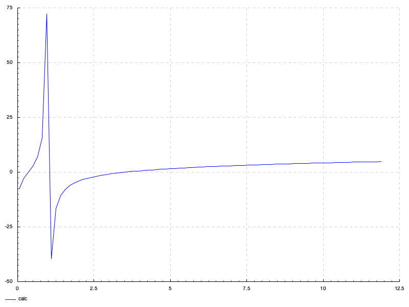

Сравнение с desmos:


### UML

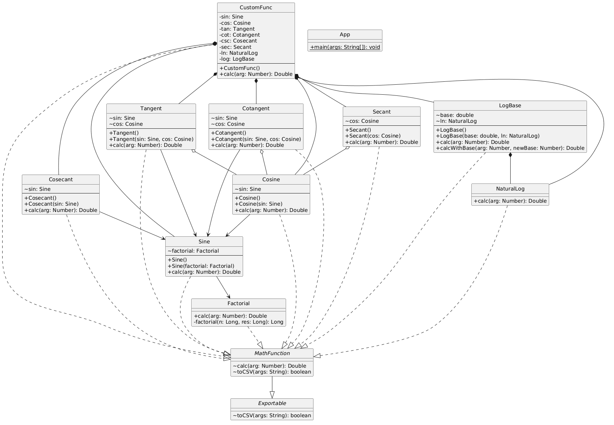

### Листинг

[Ссылка на github репозиторий](https://github.com/SolidSn4ke/st-lab2)

## Вывод

В ходе работы я провел интеграционное тестирование математических модулей, детальнее изучил различные стратегии интеграции, а также глубже узнал о строении библиотеки Mockito
