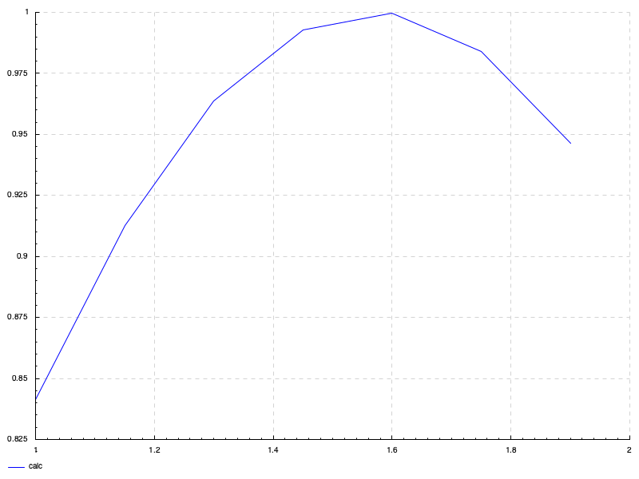

# csv-to-png

Небольшая утилита для генерации png изображения графика по данным из csv файла

## Использование

`csv-to-png-exe <Путь к csv файлу> [Путь к png файлу]`

> [!NOTE]
> <> - Обязательный параметр, [] - опциональный

## Пример использования

[Пример входных данных:](./resources/data.csv)

```csv
1.0000, 0.8415
1.1500, 0.9128
1.3000, 0.9636
1.4500, 0.9927
1.6000, 0.9996
1.7500, 0.9840
1.9000, 0.9463
```

Результат:


